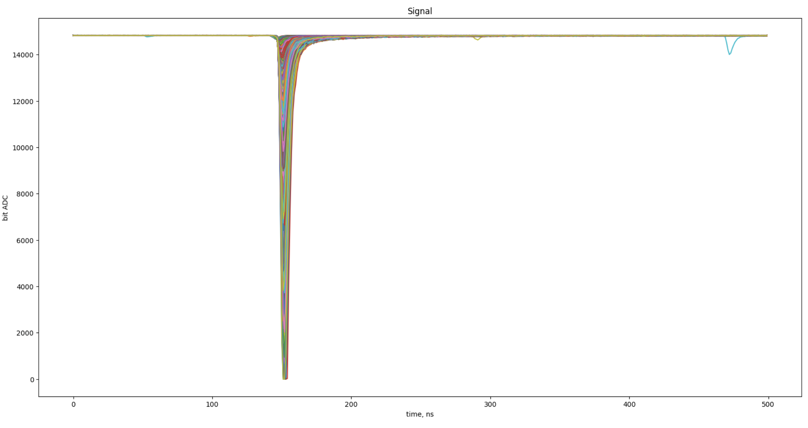
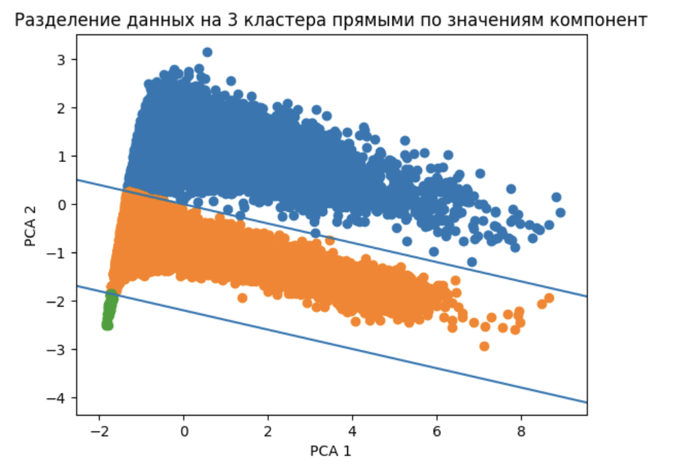
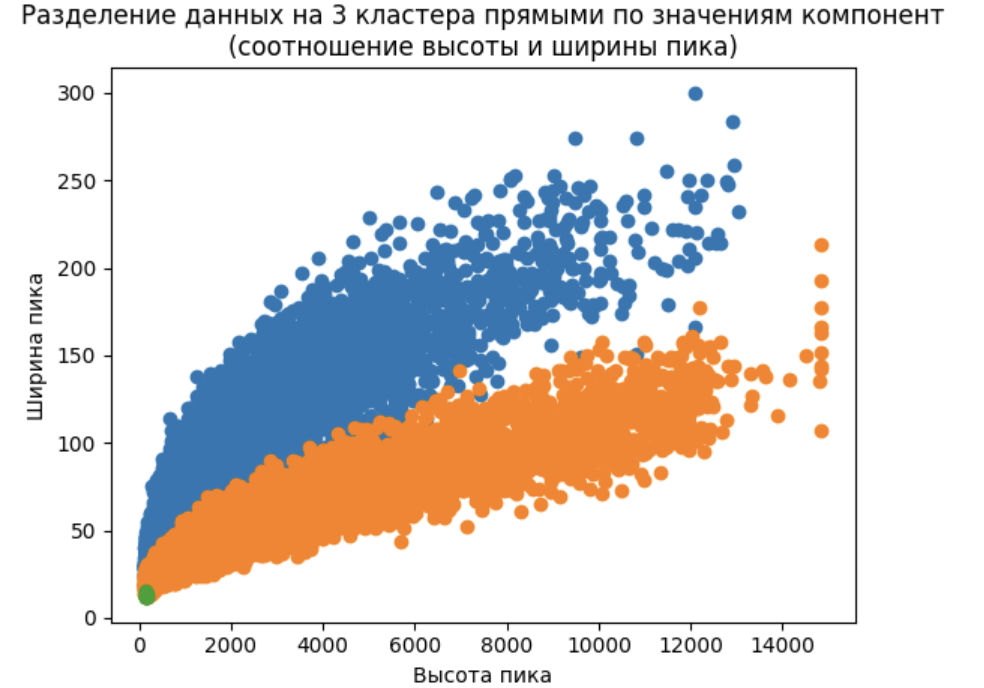
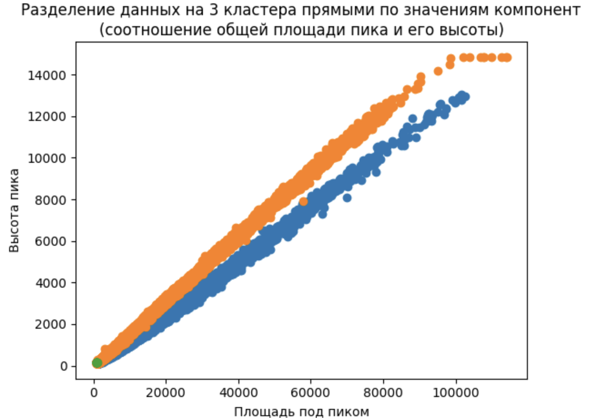

# Signal types classification

[Соревнование на Kaggle](https://www.kaggle.com/competitions/signal-types-classification/)

Необходимо определить типы сигналов сцинтилляционного детектора

## Описание задачи

В некоторых веществах в результате прохождения через них заряженных частиц возникают короткие вспышки света – сцинтилляции. Вещества, излучающие свет под действием ионизирующего излучения, называют сцинтилляторами. Задача состоит в том, чтобы по сцинтилляции охарактеризовать излучение по доле присутствия в нём отдельных компонент, таких как нейтроны и гамма-кванты

Представлены данные о 23 479 сигналах с различных набором характеристик сигналов. Задача -- кластеризовать эти сигналы на три кластера по типу сигналов: два кластера отображают типы сигналов (гамма-кванты или нейтроны), третий кластер представляет себя группу сигналов, которые не поддаются кластеризации

### Процесс обработки

Каждая анализируемая строка датасета -- сигнал. Все сигналы можно представить так:

Для удобства я "перевернула" данные о сигналах так, чтобы наблюдался не провал в данных, а пик на фоне наблюдений около 0

Сформировала новые признаки:
- Средний уровень шума для наблюдения -- усредненные показания за первые 100 наносекунд, где никаких пиков не наблюдается
- Стандартное отклонение для шума наблюдения -- понадобилось при вычислении начала и конца пика
- Высота пика
- Положение (индекс) самой высокой точки пика. Как правило, это 150 наносекунда, но бывают небольшие отклонения
- Индекс начала пика (короткого левого хвоста)
- Индекс конца пика (длинного правого хвоста)
- Ширина пика (конец пика - начало пика)
- Отношение ширины пика к его высоте
- Площадь под кривой пика (она же long)
- Площадь под наиболее высокой частью кривой пика (она же short)
- PSD (Pulse shape discrimination)

Для итогового датасета для кластеризации взяла только PSD, ширину и высоту пика, а также площадь под ними

### Итоговая модель

В процессе обработки данных с помощью метода главных компонент я поняла, что 1) большую часть поведения 4 признаков могут описать 2 компоненты; 2) если отобразить соотношение двух компонент, то можно увидеть, что кластера можно разделить прямыми:

В итоге это решение и показало лучшее разделение кластеров

Отображение кластеров на графике соотношения ширины и высоты пика:

Отображение кластеров на графике соотношения площади и высоты пика:

